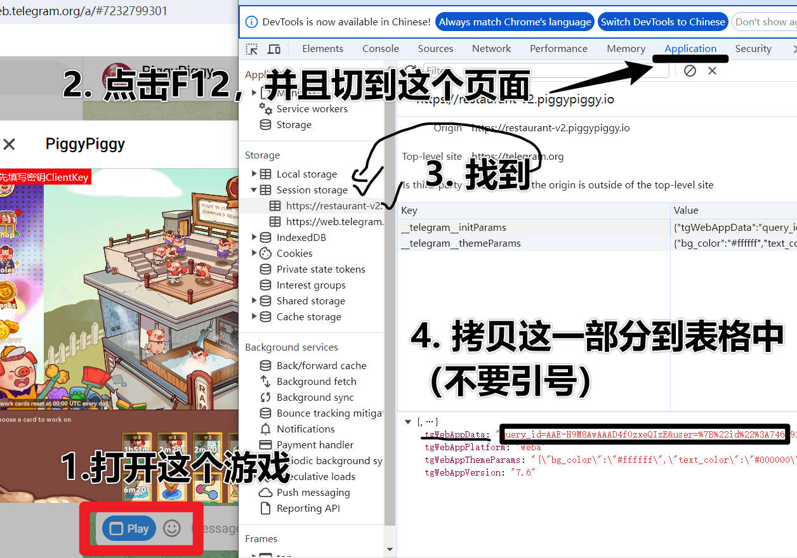

PiggyBot

- 支持自动完成任务（目前只支持实习生）
- 支持激活AIRDROP码
- 支持领取免费宝箱
- 支持完成左侧的任务（假任务，真任务做不了）

__使用方法：__
1. 重命名：example.env -> .env
2. 重命名：exapmle-data.csv -> data.csv
3. .env 不会的不用乱弄，完成一次之后可以将里面的内容清空，因为是一次性的
4. data.csv的代理为：username:password@ip:port
5. data.csv的token获取如下

6. example.env中的数据只做一次就好，做完记得删了


__依赖：__

python version:3.12

```
pip install -r requirements.txt
```
